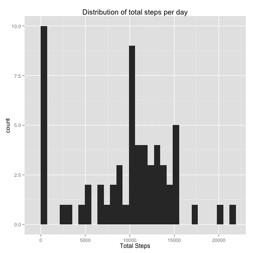
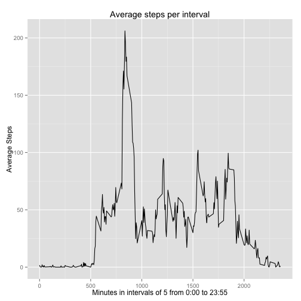
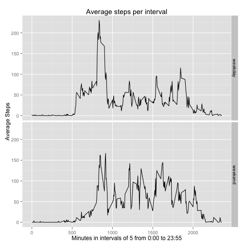

This is the R Markdown document for Course Project 1 - Reproducible Research.  Markdown is a simple formatting syntax for authoring HTML, PDF, and MS Word documents. For more details on using R Markdown see <http://rmarkdown.rstudio.com>.


```r
suppressPackageStartupMessages(library("dplyr", lib.loc="/Library/Frameworks/R.framework/Versions/3.2/Resources/library"))
suppressPackageStartupMessages(library("ggplot2", lib.loc="/Library/Frameworks/R.framework/Versions/3.2/Resources/library"))

activity.data<-read.csv("~/activity.csv")

#str(activity.data)
```

This section calculates the total number of steps by date

```r
step.sum<-activity.data %>% group_by(date) %>% summarise(total.steps=sum(steps, na.rm=TRUE))

#head(step.sum)
```

Generate a histogram of the total steps per day.


```r
h<-ggplot(step.sum, aes(total.steps))
h+geom_histogram() +
  ggtitle("Distribution of total steps per day") + 
  xlab("Total Steps")
```

 

Calculate the mean and median total number of steps

```r
step.mm <- step.sum %>% 
    summarise(mean.total.steps=mean(total.steps), 
            median.total.steps=median(total.steps))
```
The Mean number of steps is 9354.23
The Median number of steps is 10395

Calculate the mean steps per interval across days measured

```r
# Calculate mean steps per interval
step.interval <- activity.data %>%
  group_by(interval) %>%
  summarise(mean.steps=mean(steps,na.rm=TRUE))
```

Plot the time series of steps by 5 minute intervals


```r
# TS plot of mean steps per interval
d<-ggplot(step.interval, aes(interval, mean.steps))
d + geom_line() +
  ggtitle("Average steps per interval") +
  xlab("Minutes in intervals of 5 from 0:00 to 23:55") +
  ylab("Average Steps")
```

 

Determine and store the interval with the maximum number of steps


```r
# Determine interval with max number of steps on average
# get max steps
max.steps<-max(step.interval$mean.steps)
# filter data set to get interval
max.interval <- dplyr::filter(step.interval, mean.steps >= max.steps)
```

The interval with the maximum number of steps is 835 with 206 steps.


Calculate and display the number of missing values in the data set.

```r
# Calculate number of missing values in data set
nmiss<-activity.data[!complete.cases(activity.data),] %>% summarise(n())
```

The number of missing values in the data set is 2304

Impute the missing values using the mean number of steps for each 5 minute interval.


```r
# method for imputing missing data
#   First - Calculate the mean value by interval since whole days are missing
interval.means <- activity.data %>% group_by(interval) %>% 
  summarise(mean.steps = mean(steps, na.rm = TRUE))

#   Second - Impute the missing values and save to new data set *.imputed
activity.imputed<-activity.data %>% left_join(interval.means, by = "interval") %>%
  mutate(steps = ifelse(is.na(steps), mean.steps, steps),
         mean.value = NULL)

step.imputed.sum<-activity.imputed %>% 
  group_by(date) %>% 
  summarise(total.steps=sum(steps, na.rm=TRUE))
```

Calculate the mean and median number of steps for the data with missing values imputed from mean steps by interval


```r
# Report the mean and median total number of steps
step.impute.mm <- step.imputed.sum %>% 
  summarise(mean.total.steps=mean(total.steps), 
            median.total.steps=median(total.steps))
```

When missing values are replaced (imputed) by the mean of the interval, 
The Mean number of steps is 10766.19 and
the Median number of steps is 10766.19

For the raw data, 
The Mean number of steps is 9354.23 and
the Median number of steps is 10395

Creaate a variable called daytype category for weekend and weekday days


```r
activity.imputed$day<-weekdays(as.Date(as.character(activity.imputed$date)))
activity.imputed <- activity.imputed %>% 
  mutate(daytype = ifelse(day %in% c("Saturday", "Sunday"),
                          "weekend", 
                          "weekday")
         )
```

Calculate the average steps per interval by weekends and weekdays


```r
# Calculate mean steps per interval by weekends and weekdays
step.imp.interval <- activity.imputed %>%
  group_by(daytype, interval) %>%
  summarise(mean.steps=mean(steps,na.rm=TRUE))
```

Time series plot of steps by measurement interval for weekends and weekdays


```r
# TS plot of mean steps per interval
di<-ggplot(step.imp.interval, aes(interval, mean.steps))
di + geom_line() + facet_grid(daytype~.) +
  ggtitle("Average steps per interval") +
  xlab("Minutes in intervals of 5 from 0:00 to 23:55") +
  ylab("Average Steps")
```

 
